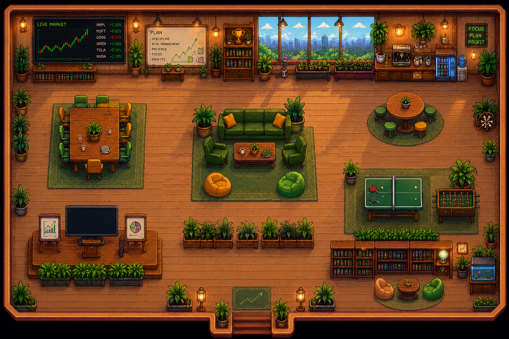

# PixelTrade — แดชบอร์ด AI Trading

จำลองห้องเทรดสไตล์ pixel-art ที่มี AI agents คอยเทรด วิเคราะห์ตลาด และบริหารพอร์ตแบบเรียลไทม์



## โปรเจคนี้คืออะไร?

PixelTrade แสดงภาพสำนักงานเทรดเสมือนจริง ที่มี AI agents เดินไปมาระหว่างสถานีทำงาน นั่งวิเคราะห์ และส่งคำสั่งซื้อขาย — ทั้งหมดเรนเดอร์ในสไตล์ pixel-art ย้อนยุค ดูพอร์ตโตหรือร่วงได้แบบเรียลไทม์

## ฟีเจอร์หลัก

- **ซิมูเลชันสด** — AI agents 6 ตัว เดินระหว่าง 11 สถานี (Trading Desk, Analytics Bay, Signal Garden, R&D Pod ฯลฯ)
- **ติดตามพอร์ตแบบเรียลไทม์** — ยอดเงิน, P&L, และกราฟ equity อัปเดตทุก tick
- **คลิกสถานีได้** — คลิกสถานีไหนก็ได้เพื่อส่ง agent ที่ใกล้ที่สุดไปทำงานทันที
- **ปรับความเร็ว** — รันที่ 1×, 2×, หรือ 4×
- **หน้า Analysis** — แผง วิเคราะห์ตลาดในแอป
- **ประวัติการเทรด** — บันทึกทุกการซื้อขาย พร้อม ticker, จำนวน, ราคา และ P&L
- **Settings** — เปิด/ปิด autopilot, animation, สี, ป้ายชื่อ agent และระดับความก้าวร้าว

## วิธีรัน

ไม่ต้อง build — เปิดในเบราว์เซอร์ได้เลย

```bash
# Clone โปรเจค
git clone <your-repo-url>
cd ai-agents

# เปิด index.html ในเบราว์เซอร์โดยตรง
# หรือใช้ local dev server
npx serve .
```

จากนั้นเปิด `http://localhost:3000`

## โครงสร้างโปรเจค

```
├── index.html          # จุดเริ่มต้น — โหลดทุกไฟล์ผ่าน Babel standalone
├── app.jsx             # Root component: state, simulation loop, การเชื่อมต่อทั้งหมด
├── sim.jsx             # สถานี, ticker, การสร้าง outcome, logic ของ agent
├── room.jsx            # เรนเดอร์ห้อง pixel-art พร้อม sprite ของ agent
├── pixel-sprite.jsx    # ตัวช่วยเรนเดอร์ pixel sprite
├── sidebar.jsx         # แผงขวา: ยอดเงิน, P&L, กราฟ equity, การแจ้งเตือน
├── views.jsx           # หน้า History และ Settings
├── analysis.jsx        # หน้าวิเคราะห์ตลาด
├── analysis-model.js   # โมเดลข้อมูลการวิเคราะห์
├── styles.css          # สไตล์ทั้งหมด (ธีมมืด สไตล์ pixel)
└── assets/
    └── room.png        # ภาพพื้นหลังห้อง
```

## ระบบซิมูเลชันทำงานอย่างไร?

แต่ละ agent มี **phase** ดังนี้: `idle → walking → working → idle`

- **idle** — agent รอสักครู่แล้วเลือกสถานีตาม **ระดับความก้าวร้าว** (ยิ่งสูง ยิ่งเทรดมาก พักน้อยลง)
- **walking** — agent เดินไปยังสถานีด้วยความเร็วคงที่
- **working** — agent ใช้เวลาทำงานที่สถานีและสร้าง outcome (เทรด, วิเคราะห์, เขียน note ฯลฯ)

outcome ส่งผลต่อยอดเงินในพอร์ตรวม การเทรดมีโอกาสชนะประมาณ 66% พร้อม P&L แบบสุ่ม

## เทคโนโลยีที่ใช้

- **React 18** (โหลดผ่าน CDN ไม่ต้องมี bundler)
- **Babel Standalone** (แปลง JSX ในเบราว์เซอร์)
- CSS ล้วน สไตล์ pixel พร้อมฟอนต์ `Pixelify Sans` และ `VT323`
- ไม่มี backend — ทุกอย่างรันฝั่ง client

## การควบคุม

| ปุ่ม | การทำงาน |
|---|---|
| ⏸ Pause / ▶ Resume | เปิด/ปิด autopilot |
| 1× / 2× / 4× | ความเร็วของซิมูเลชัน |
| คลิกสถานี | ส่ง agent ที่ว่างใกล้ที่สุดไปทำงาน |
| Settings → Reset | รีเซ็ตซิมูเลชันกลับเป็น Day 1 |

## การทดสอบ

```bash
node --experimental-vm-modules tests/analysis-model.test.js
```

## License

MIT
